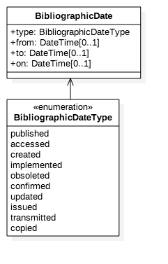

= Bibliographic reference model for ISO 690

A bibliographic model that fully supports ISO 690.

This bibliographic model is a superset of:

* Bibliography models: https://github.com/riboseinc/bib-models[BibModels]

The document models are expressed as UML and as RelaxNG Compact (RNC) grammars;
see discussion under
https://github.com/riboseinc/iso690xml/tree/master/grammars[Grammars]. This
repository contains the RNC grammars for this model.

== Bibliographic UML Models

=== Bibliographic Item

=== Bibliographic Series Item

image::images/png/Bibliography__Series_8.png[]

=== Bibliographic Dates

=== Bibliographic Item Types

=== Bibliographic Document Relations

image::images/png/Bibliography__Relations_4.png[]

=== Citation

image::images/png/Bibliography__Citation_2.png[]

=== Contribution

=== Contributor

image::images/png/Bibliography__Contributor_3.png[]

=== Data Types

