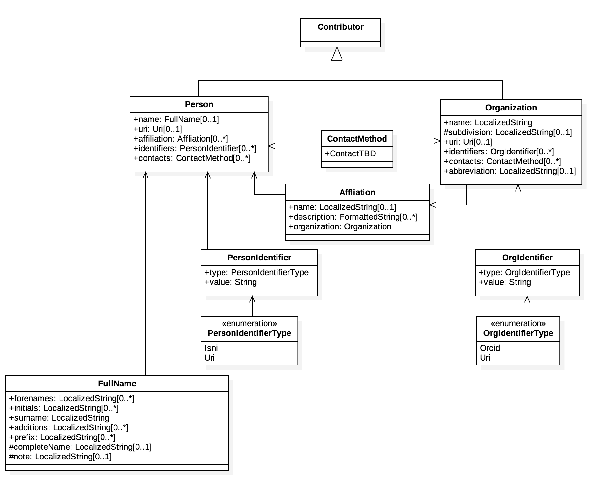
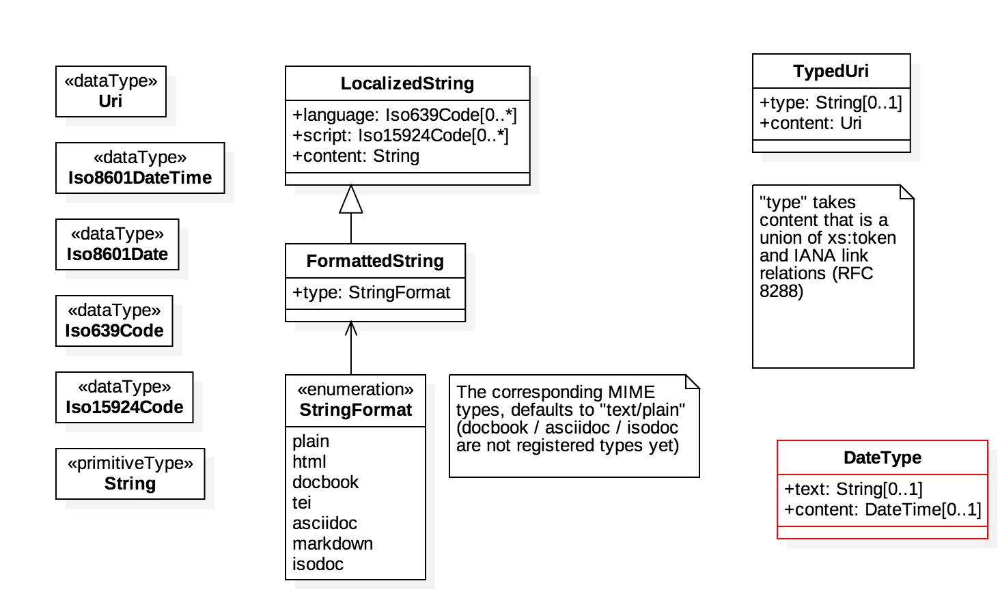
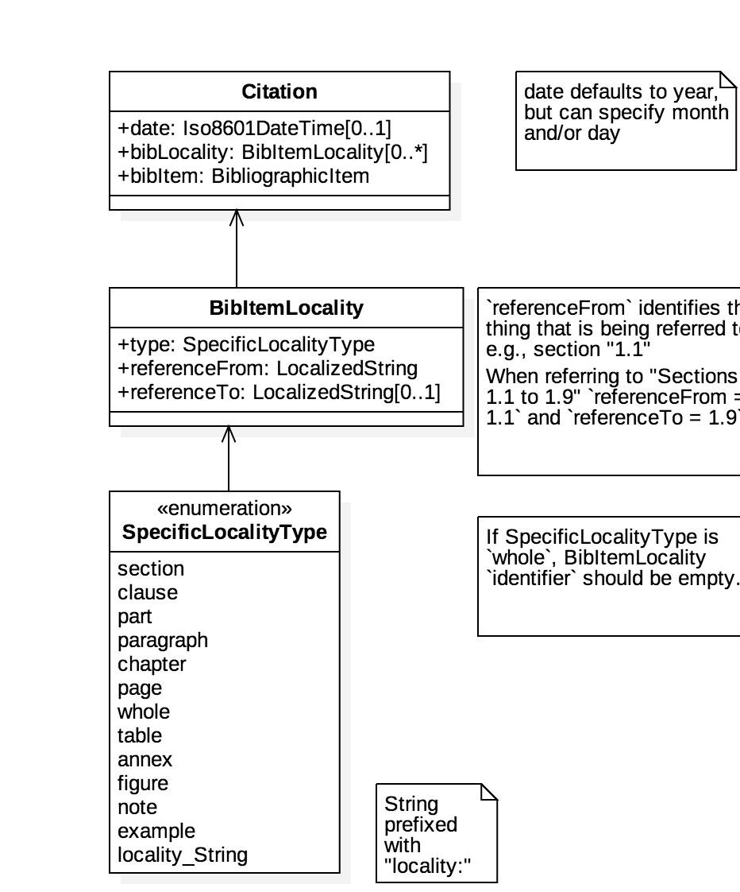

= ISO 690 XML serialisation
:title-main-en: ISO 690 XML Serialisation
:language: en
:script: Latn
:draft
:technical-committee-number: 46

[[foreword]]
.Foreword 
ISO (the International Organization for Standardization)
is a worldwide federation of national standards bodies (ISO member bodies). The work of preparing International Standards is normally carried out through ISO technical committees. Each member body interested in a subject for which a technical committee has been established has the right to be represented on that committee. International organizations, governmental and non-governmental, in liaison with ISO, also take part in the work. ISO collaborates closely with the International Electrotechnical Commission (IEC) on all matters of electrotechnical standardization.

The procedures used to develop this document and those intended for its further maintenance are described in the ISO/IEC Directives, Part 1. In particular the different approval criteria needed for the different types of ISO documents should be noted. This document was drafted in accordance with the editorial rules of the ISO/IEC Directives, Part 2 (see www.iso.org/directives).

Attention is drawn to the possibility that some of the elements of this document may be the subject of patent rights. ISO shall not be held responsible for identifying any or all such patent rights. Details of any patent rights identified during the development of the document will be in the Introduction and/or on the ISO list of patent declarations received (see www.iso.org/patents).

Any trade name used in this document is information given for the convenience of users and does not constitute an endorsement.

For an explanation on the voluntary nature of standards, the meaning of ISO specific terms and expressions related to conformity assessment, as well as information about ISO's adherence to the World Trade Organization (WTO) principles in the Technical Barriers to Trade (TBT) see the following URL: www.iso.org/iso/foreword.html.

== Introduction

// https://github.com/riboseinc/bib-models/issues/1

<<iso690>> has been in place for over 30 years as of this writing, as the ISO model of
bibliographical referencing and citation (as one of several such standards). 
During the same time, a multitude of electronic
referencing tools and conventions has evolved. However, there is no authoritative reference
on how to represent the guidelines of <<iso690>> electronically, and to evaluate the extent
to which electronic tools support it.

This document proposes a reference model and serialisation for <<iso690>>. The serialisation
can be used to represent references compliant to <<iso690>>; but being formalised and complete,
it can also be used to evaluate existing bibliographic tools for coverage of the standard,
and to identify any issues they may have. The <<bibtex>> tool has been used as a representative
bibliographic tool, because of its popularity and relative completeness.

This document also proposes an example rendering stylesheet for its serialisation, which
aligns with the examples used in <<iso690>>. <<iso690>> prescribes some aspects of rendering
(e.g. sequence, use of "in:" and "at:"), and leaves others to implementation (e.g. use of
italics, use of punctuation). The stylesheet allows the container model and the rendering
model of <<iso690>> to be differentiated, and the rendering items prescribed by <<iso690>> to
be identified clearly.

== Scope 
This document provides a reference model and serialisation for <<iso690>>, and a sample
rendering stylesheet for the serialisation.

[bibliography]
== Normative References 

The following documents are referred to in the text in such a way that some or all of their content constitutes requirements of this document. For dated references, only the edition cited applies. For undated references, the latest edition of the referenced document (including any amendments) applies.

* [[[iso690,ISO 690]]] _Information and documentation -- Guidelines for bibliographic references and citations to information resources_

[source="iso690"]
== Terms and Definitions 

=== bibliographer

The person responsible for creating a reference

[[refmodel]]
== Reference Model
The following is a UML model intended to capture the structures represented in <<iso690>>,
and is intended as a reference model for <<iso690>>. The various elements of the model 
are discussed below, with illustrations using the sample serialisation (<<serialisation>>).

The reference model for citations is provided in <<citationmodel>>.

[[uml]]
.Reference Model, ISO 690
====
.Bibliographic Item
image::images/BibliographicItem.png[]

.Contributor

.Data Types

====

[[serialisation]]
== Sample Serialisation
The following is a sample serialisation of <<refmodel>> in XML. This is not intended to be the only
possible serialisation of <<refmodel>>, whether in XML or in another format. 
In fact, existing reference tools such as <<bibtex>> are
expected to be used as serialisations. The sample serialisation is intended to provide illustrations
of the model, and to discuss the model succinctly by referencing its elements. (Of course,
the serialisation can be used in practice as a basis for data exchange of references.)

The serialisation is provided in <<relaxngcompact>>; refer to <<relaxngcompact_tutorial>> for
an introduction to the format.

[[serialisation_rnc]]
[source]
.RELAXNG Compact Serialisation, Reference Model, ISO 690
--
grammar {

status =
  element status { LocalizedString }

language = element language { text }
originallanguage = element originallanguage { text }
## ISO-639

script = element script { text }
originalscript = element originalscript { text }
## ISO-15924: Latn

edition = element edition { xsd:int }

LocalizedString =
  attribute language { text }?,
  attribute script { text }?,
  text 

FormattedString =
  attribute format { ( "text/plain" | "text/html" | "application/docbook+xml" | 
    "application/tei+xml" | "text/x-asciidoc" | "text/markdown" | "application/x-isodoc+xml" | text ) }?,
  LocalizedStringOrXsAny

LocalizedStringOrXsAny =
  attribute language { text }?,
  attribute script { text }?,
  ( text | AnyElement )+

contributor = 
  element contributor {
    role*,
    ContributorInfo
}

role =
  element role {
    attribute type { ( "author" | "performer" | "publisher" | "editor" | "adapter" | "translator" | "distributor" ) }?,
    roledescription*
}

ContributorInfo =
  ( person | organization )

roledescription = 
  element description { FormattedString }

person = 
  element person {
    fullname?, affiliation*, person-identifier*, contact*, uri?
}

fullname =
  element name {
    (( prefix*, forename*, initial*, surname, addition* ) | completeName | 
       prefix*, forename*, initial*, surname, addition*, completeName)),
    bnote*
}

prefix = element prefix { LocalizedString }
initial = element initial { LocalizedString }
addition = element addition { LocalizedString }
surname = element surname { LocalizedString }
forename = element forename { LocalizedString }
completename = element completename { LocalizedString }

affiliation =
  element affiliation { 
    affiliationname?, affiliationdescription*, organization
}

affiliationname = element name { LocalizedString }

affiliationdescription = element description { FormattedString }

organization = 
  element organization {
    orgname, subdivision?, abbreviation?, uri?, org-identifier*, contact*
}

orgname = element name { LocalizedString }
subdivision = element subdivision { LocalizedString }

abbreviation =
  element abbreviation { LocalizedString }

uri =
  element uri { xsd:anyURI }

# TODO may change
contact =
  ( address | phone | email | uri )

phone = element phone { text }
email = element email { text }

address =
  element address {
    # iso191606 TODO
    street+, city, state?, country, postcode?
}

street = element street { text }
city = element city { text }
state = element state { text }
country = element country { text }
postcode = element postcode { text }

person-identifier =
  element identifier {
    attribute type { ("isni" | "uri") },
    text
  }

org-identifier =
  element identifier {
    attribute type { ("orcid" | "uri") },
    text
  }

citation =
  element citation { CitationType }

CitationType = 
    attribute bibitemid { xsd:IDREF },
    locality*, date?

date = element date { ( xsd:gYear | xsd:date )  }

locality =
  element locality {
    # attribute type { ( "section" | "clause" | "part" | "paragraph" | "chapter" | "page" | "whole" | "table" | "annex" | "figure" | "note" | "example" | ("locality:", text) ) },
    attribute type { LocalityType },
    referenceFrom, referenceTo?
}

LocalityType = xsd:string { pattern = "section|clause|part|paragraph|chapter|page|whole|table|annex|figure|note|example|locality:[a-zA-Z0-9_]+" } 

referenceFrom = element referenceFrom { text }
referenceTo = element referenceTo { text }

bibitem =
  element bibitem { 
     attribute id { xsd:ID },
     BibliographicItem 
}

bibitem_no_id =
  element bibitem { 
     BibliographicItem 
}

BibItemType |=
    (  "article" | "book" | "booklet" | "conference" | "manual" |
       "proceedings" | "presentation" | "thesis" | "techreport" |
       "standard" | "unpublished" | "map" | "electronic resource" | 
       "audiovisual" | "map" | "film" | "video" | "broadcast" |
       "graphic work" | "music" | "patent" )
 

BibliographicItem =
    attribute type { BibItemType }?,
    (btitle+ | formattedref), bsource*, docidentifier*, bdate*, contributor*, 
    edition?, biblionote*, language*, script*, originallanguage*, originalscript*,
    abstract?, status?, copyright?, docrelation*, series*, medium?, bplace*,
    extent*, accesslocation*, bclassification, size?, scale?

btitle = element title { TypedTitleString }
bsource = element link { TypedUri }
formattedref = element formattedref { FormattedString }
link = element link { TypedUri }

TypedTitleString = 
  attribute type { TitleType }?,
  FormattedString  

TitleType = ( "alternative" | "original" | "unofficial" | "subtitle" | "main" )

TypedUri =
  attribute type { text }?,
  xsd:anyURI 

DateType =
  attribute text { text }?,
  ( xsd:gYear | xsd:date )?

bdate = element date {
  attribute type { ( "published" | "accessed" | "created" | "implemented" | "obsoleted" | "confirmed" | "updated" | "issued" | "transmistted" | "copyright" ) },
  bfrom, bto?
}

bfrom = element from { DateType }
bto = element to { DateType }

docidentifier = element docidentifier { 
  attribute type { text }?,
  text 
}
bclassification = element classification { 
  attribute type { text }?,
  text 
}

bplace = element place { text }
medium = element medium { text }
size = element size { text }
scale = element scale { text }
accesslocation = element accesslocation { text }

extent = element extent {
  attribute type { SpecificLocalityType },
  text
}

series = element series {
  attribute type { "main" | "alt" }?,
  ( btitle | formattedref ),
  bplace, seriesorganization,
  abbreviation?,
  seriesfrom?, seriesto?,
  seriesnumber?, seriespartnumber?
}

seriesorganization = element organization { text }
seriesfrom = element from { xsd:dateTime | xsd:gYear }
seriesto = element to { xsd:dateTime | xsd:gYear }
seriesnumber = element number { text }
seriespartnumber = element partnumber { text }

biblionote = element note { FormattedString }
abstract = element abstract { FormattedString }

copyright =
  element copyright {
    from, to?, owner
}

from = element from { xsd:gYear }
to = element to { xsd:gYear }

owner =
  element owner { ContributorInfo }

docrelation =
  element relation {
    attribute type {
      ( "parent" | "child" | "obsoletes" | "updates" | "updatedBy" | "complements" | "derivedFrom" |
        "adoptedFrom" | "equivalent" | "identical" | "nonequivalent" | "includedIn" ) },
       element bibitem { BibliographicItem },
       locality*
}

AnyElement = element * { ( text | AnyElement) }

}
--

== Overarching guidelines

=== Provenance

Information in a reference typically comes from the publisher of a resource, and is
included in the resource itself, as described in <<iso690,clause 4.1.2>>. <<iso690,clause 4.1.2>>
permits information to be supplied by other parties, and differentiated by including it in
brackets. This can include both missing information (e.g. "[Untitled]"), and corrections
(e.g. "1959 [i.e. 1995]").

The party supplying emendations to reference information is identified in <<iso690,clause 4.1.2>>
as the citer of the reference. However, the citer should be differentiated from the bibliographer, 
in the case of bibliographies as consumable resources (e.g. as bibliographic databases):

* The publisher provides the primary source information about the resource, typically in the 
resource itself, but also as a feed of information to a bibliographer.
* The bibliographer compiles a bibliography as a list of references, and uses their judgement
to supply information and to impose uniform representation and rendering of the list.
* The citer uses a bibliography within a resource, to identify cited resources, and may further
adjust the bibliography they provide within the resource (e.g. for disambiguation, or to disaggregate
references included in other references.

The bibliographer and the publisher in the contemporary bibliography universe are more active
parties than in the traditional model, which relies exclusively on citer discretion. Bibliographers
and publishers are invested in asserting that they are sources of truth about bibliographic
resources; and the bibliographies covered by any model of electronic exchange include references
provided by bibliographers and publishers, in bibliographic databases—as well as the references 
consumed and adjusted by citers from bibliographic databases.

So the original reference as obtained from a bibliographic database may need to be differentiated
from any adjustments made to the reference by a citer; and the citer adjustments in some contexts may
need to be overridden. 

This means indicating the provenance of bibliographic information, and allowing multiple versions
of the same information, with differing provenance. At the simplest level there will simply be
two or more different versions of the reference serialisation, some representing the publisher or
bibliographer's source of truth, and some representing the citer's adjustments (in brackets). 
Adjustments made by the bibliographer would also be represented in brackets; this is long-standing 
routine practice in library catalogues.

A more granular approach would be to permit multiple instances of any element in the reference
model, differentiated by provenance: this could be done with a child element (e.g. an XML attribute),
or with a nested container. If no provenance is indicated, the information is assumed to be
unchanged from the source of truth. A renderer can then choose which alternative to render depending 
on local requirements:

.Differential Provenance
====
[source,xml]
--
<bibitem>
  <date>1959</date>
</bibitem>

<bibitem source="citer">
  <date>1959 [i.e. 1995]</date>
</bibitem>

<bibitem>
  <date>1959</date>
  <date source="citer">1959 [i.e. 1995]</date>
</bibitem>
--
====

Breaking out completions and emendations into separate elements in the model (e.g. 
`<date><orig>1959</orig><corr>1995</corr></date>`) is not desirable,
given how open-ended emendations can be (e.g. appearing anywhere in a string): they would complicate
any serialisation of the model, to little real benefit. 

== Discussion of model

=== General

In the following, the model is discussed with reference to <<iso690>>, with the rendered
bibliographic references of each clause in <<iso690>> serialised according to <<serialisation>>.

Each aspect of the model is given with a cross-reference to <<iso690>>; a listing of the
relevant model components; and a listing of the corresponding components of <<bibtex>>.

[[bibtype]]
=== Categories of information resource

==== General

* Source: <<iso690,clause 15>>
* Serialisation: `bibitem@type`, `BibItemType`

|===
|ISO 690 |BibTeX

|`bibitem@type`|
|===

While <<iso690>> does not prescribe a list of possible bibliographic types, there are
categories specific to particular information resource categories (<<iso690,clause 15>>),
as well as rendering rules specific to information resource categories (e.g. 
<<iso690,clause 15.6.4>>: series title appears before item title for broadcasts). For that
reason, bibliographic items should indicate what bibliographic type they belong to.

The list of bibliographic types proposed is a union of the BibTeX types and the types
listed in ISO 690. Master's Thesis and PhD Thesis from BibTeX are subsumed under "thesis".
The list maintains the BibTeX distinction between:

"inbook":: A typically untitled part of a book. May be a chapter (or section, etc.) and/or a range of pages.
"incollection":: A part of a book having its own title.
"inproceedings":: An article in a conference proceedings.
"article":: An article from a journal or magazine.

=== Creator

==== General

* Source: <<iso690,clause 5>>
* Serialisation: `bibitem/contributor`, `Person, Organization, Affiliation`

|===
|ISO 690 |BibTeX

|`bibitem/contributor`|
|`bibitem/contributor@role`|
|`bibitem/contributor/description`|
|`bibitem/contributor/person`|
|`bibitem/contributor/person/name`|
|`bibitem/contributor/person/name/completeName`|
|`bibitem/contributor/person/name/forename`|
|`bibitem/contributor/person/name/initials`|
|`bibitem/contributor/person/name/surname`|
|`bibitem/contributor/person/name/addition`|
|`bibitem/contributor/person/name/prefix`|
|`bibitem/contributor/person/name/note`|
|`bibitem/contributor/person/uri`|
|`bibitem/contributor/person/affiliation`|
|`bibitem/contributor/person/affiliation/name`|
|`bibitem/contributor/person/affiliation/description`|
|`bibitem/contributor/person/affiliation/organization`|
|`bibitem/contributor/person/identifier`|
|`bibitem/contributor/person/identifier@type`|
|`bibitem/contributor/person/contact`|
|`bibitem/contributor/organization`|
|`bibitem/contributor/organization/name`|
|`bibitem/contributor/organization/subdivision`|
|`bibitem/contributor/organization/uri`|
|`bibitem/contributor/organization/identifier`|
|`bibitem/contributor/organization/identifier@type`|
|`bibitem/contributor/organization/contact`|
|`bibitem/contributor/organization/abbreviation`|
|===

==== Selection

<<iso690,clause 5.1>> classifies the various possible roles a creator can have with
regard to a resource into six broad categories in order of priority, 
with more refined classifications typically named for the creator. These classifications
are retained in the model: `bibitem/contributor/role@type` provides the broad category
of role (author, performer, compiler, adaptor, publisher, distributor, corresponding to
<<iso690,clause 5.1.a>> through <<iso690,clause 5.1.f>>), while `bibitem/contributor/role/description`
contains one or more specific descriptions of the role of the contributor.

Whether subsidiary creators should be included in a bibliographic item, and which
creators should be included, is at the discretion of the bibliographer; see <<iso690,clause 5.4.5>>;
<<iso690,clause 5.4.6>>.

Exceptionally, "translator" is differentiated from the other "adaptor" roles of 
<<iso690,clause 5.1.d>>, because it is so different to other adaptor roles such as
engraver or photographer. 

NOTE: Although both composer and librettist are included as authors under 
<<iso690,clause 5.1.a>>, but
the two roles are clearly differentiated in <<iso690,clause 15.8.1>>, with the composer 
given priority over the librettist.

NOTE: Inventor is atypical of the "performer" roles included in <<iso690,clause 5.1.b>>,
and could arguably be regarded as an author role instead, alongside patentee.

====
Ramsey, J. K., & McGrew, W. C. (2005). Object play in great apes: Studies in nature and captivity. 
In A. D. Pellegrini & P. K. Smith (Eds.), _The nature of play: Great apes and humans_ 
(pp. 89-112). New York, NY: Guilford Press.

[source,xml]
--
<bibitem type="incollection">
  <title>Object play in great apes: Studies in nature and captivity</title>
  <date type="published">2005</date>
  <contributor>
    <role type="author"/>
    <person>
      <name>
        <surname>Ramsey</surname>
        <initials>J. K.</initials>
      </name>
    </person>
  </contributor>
  <contributor>
    <role type="author"/>
    <person>
      <name>
        <surname>McGrew</surname>
        <initials>W. C.</initials>
      </name>
    </person>
  </contributor>
  <relation type="includedIn">
    <bibitem>
      <title>The nature of play: Great apes and humans</title>
      <contributor>
        <role type="editor"/>
        <person>
          <name>
            <surname>Pellegrini</surname>
            <initials>A. D.</initials>
          </name>
        </person>
      </contributor>
      <contributor>
        <role type="editor"/>
        <person>
          <name>
            <surname>Smith</surname>
            <initials>P. K.</initials>
          </name>
        </person>
      </contributor>
      <contributor>
        <role type="publisher"/>
        <organization>
          <name>Guilford Press</name>
        </organization>
      </contributor>
      <place>New York, NY</place>
    </bibitem>
    <locality type="page">
      <referenceFrom>89</referenceFrom>
      <referenceFrom>112</referenceFrom>
    </locality>
  </relation>
</bibitem>
--
====

====
Demosthenes. _Speeches 50-59_. Translated from the Greek by
Victor BERS. Austin: University of Texas Press, 2003.

[source,xml]
--
<bibitem type="book">
  <title>Speeches 50-59</title>
  <date type="published">2003</date>
  <contributor>
    <role type="author"/>
    <person>
      <name>
        <completeName>Demosthenes</completeName>
      </name>
    </person>
  </contributor>
  <contributor>
    <role type="translator"/>
    <person>
      <name>
        <surname>Bers</surname>
        <initials>Victor</initials>
      </name>
    </person>
  </contributor>
  <contributor>
    <role type="publisher"/>
    <organization>
      <name>University of Texas Press</name>
    </organization>
  </contributor>
  <language>en</language>
  <originalLanguage>grc</originalLanguage>
  <place>Austin</place>
</bibitem>
--
====

====
ROGET, Peter Mark. _Roget's Thesaurus_. Revised by
Susan M. LLOYD. Burnt Mill, Harlow, Essex: Longman Group Limited, 1982 [1852].

[source,xml]
--
<bibitem type="book">
  <title>Roget's Thesaurus</title>
  <date type="created">1852</date>
  <date type="updated">1982</date>
  <date type="published">1982</date>
  <contributor>
    <role type="author"/>
    <person>
      <name>
        <surname>Roget</surname>
        <forename>Peter</forename>
        <forename>Mark</forename>
      </name>
    </person>
  </contributor>
  <contributor>
    <role type="editor">revised</role>
    <person>
      <name>
        <surname>Lloyd</surname>
        <forename>Susan</forename>
        <forename>M.</forename>
      </name>
    </person>
  </contributor>
  <contributor>
    <role type="publisher"/>
    <organization>
      <name>Longman Group Limited</name>
    </organization>
  </contributor>
  <place>Burnt Mill, Harlow, Essex</place>
</bibitem>
--
====

====
WINSBACHER KNABENCHOR. All' Lust und Freud'. Frankfurt: Bellaphon, 1983.

[source,xml]
--
<bibitem type="audiovisual">
  <title>All' Lust und Freud'</title>
  <date type="published">1983</date>
  <contributor>
    <role type="performer"/>
    <organization>
      <name>Winsbacher Knabenchor</name>
    </organization>
  </contributor>
  <contributor>
    <role type="composer"/>
    <person><name><completeName>Gastoldi, Giovanni Giacomo</completeName></name></person>
  </contributor>
  <contributor>
    <role type="composer"/>
    <person><name><completeName>Isaak, Heinrich</completeName></name></person>
  </contributor>
  <contributor>
    <role type="composer"/>
    <person><name><completeName>Othmayr, Caspar</completeName></name></person>
  </contributor>
  <contributor>
    <role type="composer"/>
    <person><name><completeName>Demantius, Christoph</completeName></name></person>
  </contributor>
  <contributor>
    <role type="publisher"/>
    <organization>
      <name>Bellaphon</name>
    </person>
  </organization>
  <place>Frankfurt</place>
</bibitem>
--
====

==== Personal names

Names may be modelled either broken up into their constituent components (prefix, forename, 
initials, surname, addition), or as a complete name string. The latter is useful if
(unlike the recommendation of <<iso690,clause 5.2.1>>)
language-specific conventions for ordering of name components are to be observed; e.g.
"James CLARK, John COWAN, MURATA Makoto". 

====
BACH, J.S.

[source,xml]
--
<person>
  <name>
    <surname>Bach</surname>
    <initials>J. S.</initials>
  </name>
</person>
--
====

====
PICASSO, Pablo

[source,xml]
--
<person>
  <name>
    <surname>Picasso</surname>
    <forename>Pablo</forename>
  </name>
</person>
--
====

====
KING, Martin Luther, Jr., Rev.

[source,xml]
--
<person>
  <name>
    <prefix>Dr.</prefix>
    <surname>King</surname>
    <forename>Martin</forename>
    <forename>Luther</forename>
    <addition>Jr.</addition>
    <addition>Rev.</addition>
  </name>
</person>
--
====

====
KING, Martin Luther, Jr.

[source,xml]
--
<person>
  <name>
    <completeName>KING, Martin Luther, Jr.</completeName>
  </name>
</person>
--
====

[[organisation]]
==== Organisations

The model caters for both full names and abbreviations of organisations (<<iso690,clause 5.3.1>>). 
Subordinate body names are modelled separately from the parent body name; the choice of whether
to model parent + subordinate or a single name depends on the degree of independence
of the subordinate body, as outlined in <<iso690,clause 5.3.3>>.

====
St. Thomas University [Florida].

[source,xml]
--
<organization>
  <name>St. Thomas University [Florida]</name>
</organization>
--
====

====
St. Thomas University [New Brunswick].

[source,xml]
--
<organization>
  <name>St. Thomas University [New Brunswick]</name>
</organization>
--
====

====
ACADEMY OF ATHENS. Research Centre for Modern Greek Dialects.

[source,xml]
--
<organization>
  <name>Academy of Athens</name>
  <subdivision>Research Centre for Modern Greek Dialects</subdivision>
</organization>
--
====

==== Pseudonyms

If both the assumed and the real name of the creator are known, the supplementary
real name (<<iso690,clause 5.5>>) should be modelled as a note:

====
TWAIN, Mark [pseud. of Samuel Langhorne CLEMENS]

[source,xml]
--
<person>
  <surname>Twain</surname>
  <forename>Mark</forename>
  <note>pseud. of Samuel Langhorne CLEMENS</note>
</person>
--
====

TODO: Or should we model as a relation between two names? Notes don't have an internal structure, 
so can't identify the surname.

==== Anonymous and Varii

Descriptors of authors, such as "Anon" (<<iso690,clause 5.6>>) or "Various Authors", should be given as completeName
elements. As with pseudonyms, the real name of the creator if known can be modelled as a note.

====
Anon. _Sir Gawain and the Green Knight_. Edited by R. A. WALDRON. Evanston: Northwestern
University Press, 1970.

[source,xml]
--
<bibitem type="book">
  <title>Sir Gawain and the Green Knight</title>
  <date type="published">1970</date>
  <contributor>
    <role type="author"/>
    <person><name><completeName>Anon</completeName></name></person>
  </contributor>
  <contributor>
    <role type="editor"/>
    <person><name><completeName>R. A. WALDRON</completeName></name></person>
  </contributor>
  <contributor>
    <role type="publisher"/>
    <organization>
      <name>Northwestern University Press</name>
    </person>
  </organization>
  <place>Evanston</place>
</bibitem>
--
====

====
Anon [Thomas Robert MALTHUS]. _An Essay on the Principle of Population_. 1st edition.
London: J. Johnson, 1798.

[source,xml]
--
<bibitem type="book">
  <title>An Essay on the Principle of Population</title>
  <date type="published">1798</date>
  <contributor>
    <role type="author"/>
    <person><name><completeName>Anon</completeName></name></person>
    <note>Thomas Robert MALTHUS</note>
  </contributor>
  <contributor>
    <role type="publisher"/>
    <person><name><completeName>J. Johnson</completeName></name></person>
  </contributor>
  <edition>1st</edition>
  <place>London</place>
</bibitem>
--
====

=== Title

==== General

* Source: <<iso690,clause 6.1,clasue 6.2>>
* Serialisation: `bibitem/title`

|===
|ISO 690 |BibTeX

|`bibitem/title`|
|`bibitem/title@type`|
|`bibitem/title@format`|
|`bibitem/title@language`|
|`bibitem/title@script`|
|===

==== Alternative titles

A resource can have multiple titles (<<iso690,clause 6.1.2>>), including alternative titles
(<<iso690,clause 6.1.3>>) and subtitles (<<iso690,clause 6.1.4>>). Titles are classified
through `title@type`; the model allows for "alternative", "subtitle", "unofficial" (i.e.
a title that has become prevalent but has never been the official/intended title of the resource),
"original" (including the source language title of a translated resource) (<<iso690,clause 6.2>>), 
and "main" (for the proper title or titles of the resource). If a title type is
not given, it is assumed to be a main title.

"Untitled" can be treated as a main title (<<iso690,clause 6.1.7>>).

====
Lemuel Gulliver [pseud. of Jonathan Swift].
_Travels into Several Remote Nations of the World. In Four Parts_ [Gulliver's Travels]. 
London: Ben. Motte, 1798.

[source,xml]
--
<bibitem type="book">
  <title type="original">Travels into Several Remote Nations of the World. In Four Parts</title>
  <title type="unofficial">Gulliver's Travels</title>
  <date type="published">1726-1727</date>
  <contributor>
    <role type="author"/>
    <person><name><completeName>Lemuel Gulliver</completeName></name></person>
    <note>pseud. of Jonathan Swift</note>
  </contributor>
  <contributor>
    <role type="publisher"/>
    <person><name><completeName>Benj. Motte</completeName></name></person>
  </contributor>
  <place>London</place>
</bibitem>
--
====

====
Sun Tzu.
_The Art of War_ [孫子兵法]. Translated by Samuel B. Griffith.
Oxford: Oxford University Press, 1963.

[source,xml]
--
<bibitem type="book">
  <title type="original" lang="zh" script="Hant">孫子兵法</title>
  <title type="main">The Art of War</title>
  <date type="published">1963</date>
  <contributor>
    <role type="author"/>
    <person><name><completeName>Sun Tzu</completeName></name></person>
  </contributor>
  <contributor>
    <role type="translator"/>
    <person><name><completeName>Samuel B. Griffith</completeName></name></person>
  </contributor>
  <contributor>
    <role type="publisher"/>
    <organization><name>Oxford University Press</name></organization>
  </contributor>
  <place>Oxford</place>
</bibitem>
--
====

====
Sigur Rós.
Untitled [Vaka]. In: _( )_. Track 1.
Mosfellsbær: Sundlaugin, 2002.

[source,xml]
--
<bibitem type="audiovisual">
  <title>Untitled</title>
  <title type="unofficial">Vaka</title>
  <date type="published">2002</date>
  <contributor>
    <role type="composer">
    <organization><name><completeName>Sigur Rós</completeName></name></organization>
  </contributor>
  <relation type="includedIn">
    <bibitem>
      <title>( )</title>
      <contributor>
        <role type="composer">
        <organization><name><completeName>Sigur Rós</completeName></name></organization>
      </contributor>
      <contributor>
        <role type="publisher"/>
        <organization><name>Sundlaugin</name></organization>
      </contributor>
      <place>Mosfellsbær, Iceland</place>
    </bibitem>
    <locality type="track">
      <referenceFrom>1</referenceFrom>
    </locality>
  </relation>
</bibitem>
--
====

=== Host Item

==== General

* Source: <<iso690,clause 6.4>>
* Serialisation: `bibitem/relation`

|===
|ISO 690 |BibTeX

|`bibitem/relation`|
|`bibitem/relation@type`|
|`bibitem/relation/bibitem`|
|`bibitem/relation/bibLocality`|
|===

Of the bibliographic types identified in <<bibtype>>, incollection, inproceedings, and
inbook are all inherently related to a host item. Other types also potentially involve
relations with host items; for example, the relation between a record track and a record,
or a broadcast segment and a broadcast show.

The model allows for various relations between bibliographic items, identifying their
provenance and currency—including derivedFrom, adoptedFrom, updates, and updatedBy. The
relation between host item and contained item is modelled through "includedIn". The relation
between the two items includes a locality element, indicating the extent of the contained
item within the host item.

NOTE: You have parent/child, but includedIn/includes is more intuitive.

====
Ramsey, J. K., & McGrew, W. C. (2005). Object play in great apes: Studies in nature and captivity. 
In A. D. Pellegrini & P. K. Smith (Eds.), _The nature of play: Great apes and humans_ 
(pp. 89-112). New York, NY: Guilford Press.

[source,xml]
--
<bibitem type="incollection">
  <title>Object play in great apes: Studies in nature and captivity</title>
  <date type="published">2005</date>
  <contributor>
    <role type="author"/>
    <person>
      <name>
        <surname>Ramsey</surname>
        <initials>J. K.</initials>
      </name>
    </person>
  </contributor>
  <contributor>
    <role type="author"/>
    <person>
      <name>
        <surname>McGrew</surname>
        <initials>W. C.</initials>
      </name>
    </person>
  </contributor>
  <relation type="includedIn">
    <bibitem>
      <title>The nature of play: Great apes and humans</title>
      <contributor>
        <role type="editor"/>
        <person>
          <name>
            <surname>Pellegrini</surname>
            <initials>A. D.</initials>
          </name>
        </person>
      </contributor>
      <contributor>
        <role type="editor"/>
        <person>
          <name>
            <surname>Smith</surname>
            <initials>P. K.</initials>
          </name>
        </person>
      </contributor>
      <contributor>
        <role type="publisher"/>
        <organization>
          <name>Guilford Press</name>
        </organization>
      </contributor>
      <place>New York, NY</place>
    </bibitem>
    <locality type="page">
      <referenceFrom>89</referenceFrom>
      <referenceFrom>112</referenceFrom>
    </locality>
  </relation>
</bibitem>
--
====

====
Sigur Rós.
Untitled [Vaka]. In: _( )_. Track 1.
Mosfellsbær: Sundlaugin, 2002.

[source,xml]
--
<bibitem type="audiovisual">
  <title>Untitled</title>
  <title type="unofficial">Vaka</title>
  <date type="published">2002</date>
  <contributor>
    <role type="composer">
    <organization><name><completeName>Sigur Rós</completeName></name></organization>
  </contributor>
  <relation type="includedIn">
    <bibitem>
      <title>( )</title>
      <contributor>
        <role type="composer">
        <organization><name><completeName>Sigur Rós</completeName></name></organization>
      </contributor>
      <contributor>
        <role type="publisher"/>
        <organization><name>Sundlaugin</name></organization>
      </contributor>
      <place>Mosfellsbær, Iceland</place>
    </bibitem>
    <locality type="track">
      <referenceFrom>1</referenceFrom>
    </locality>
  </relation>
</bibitem>
--
====

=== Medium

* Source: <<iso690,clause 7>>
* Serialisation: `bibitem/medium`

|===
|ISO 690 |BibTeX

|`bibitem/medium`|
|===

There is no fixed vocabulary modelled for medium.

=== Edition

=== Production

=== Numeration

=== Series title and number

==== General

* Source: <<iso690,clause 6.3>>, <<iso690,clause 6.11>>
* Serialisation: `bibitem/series`

|===
|ISO 690 |BibTeX

|`bibitem/series`|
|`bibitem/series@type`|
|`bibitem/series/title`|
|`bibitem/series/place`|
|`bibitem/series/organization`|
|`bibitem/series/formattedTitle`|
|`bibitem/series/abbrev`|
|`bibitem/series/dateFrom`|
|`bibitem/series/dateTo`|
|`bibitem/series/number`|
|`bibitem/series/partnumber`|
|===

==== Qualifiers

Organization and Place of Publication can be added to series titles for disambiguation
(<<iso690,clause 6.3.1>>).
Organization in this instance is only modelled as a strings, rather than as a detailed 
object (cf. <<organisation>>). The formattedTitle element is used to enforce the formatting
of the series title and its qualifiers.

====
_Life_. MDPI.
_Life_ (Basel). (https://en.wikipedia.org/wiki/Life_(journal))

[source,xml]
--
<series>
  <title>Life</title>
  <place>Basel</place>
  <organization>MDPI</organization>
  <formattedTitle>_Life_ (Basel)</formattedTitle>
</series>
--
====

====
_Life_. (New York). (https://en.wikipedia.org/wiki/Life_(magazine))

[source,xml]
--
<series>
  <title>Life</title>
  <place>New York</place>
</series>
--
====

==== Earlier and later titles

The current title of a series is given with `series@type` as "main" (which is the default); 
alternate titles, including 
historical titles, are given with `series@type` as "alt". Different time spans for historical
titles are given with `series/dateFrom` and `series/dateTo` (<<iso690,clause 6.3.3>>).

====
_New Scientist_. 1956-1971. +
_New Scientist and Science Journal. Jan 21, 1971-Sept 30, 1971. +
_New Scientist_. 1971-.

[source,xml]
--
<series type="alt">
  <title>New Scientist</title>
  <dateFrom>1956</dateFrom>
  <dateTo>1956</dateTo>
</series>
<series type="alt">
  <title>New Scientist and Science Journal</title>
  <dateFrom>1971-01-21</dateFrom>
  <dateTo>1971-09-30</dateTo>
</series>
<series type="main">
  <title>New Scientist</title>
  <dateFrom>1971-09-30</dateFrom>
</series>
--
====

=== Identifiers

=== Location

=== Additional general information

=== Specific categories of information resource

[[citationmodel]]
[appendix]
== Citation Model

[[citation_uml]]
.Reference Model, ISO 690 Citations

[bibliography]
== Bibliography 

* [[[bibtex,1]]], BibTeX. http://www.bibtex.org

* [[[relaxngcompact,2]]], OASIS. RELAX NG Compact Syntax. Edited by James Clark. 2002-11-21. http://relaxng.org/compact.html

* [[[relaxngcompact_tutorial,2]]], OASIS. RELAX NG Compact Syntax Tutorial. 
Edited by James Clark, John Cowan, MURATA Makoto. 2003-03-26. 
http://www.relaxng.org/compact-tutorial-20030326.html
